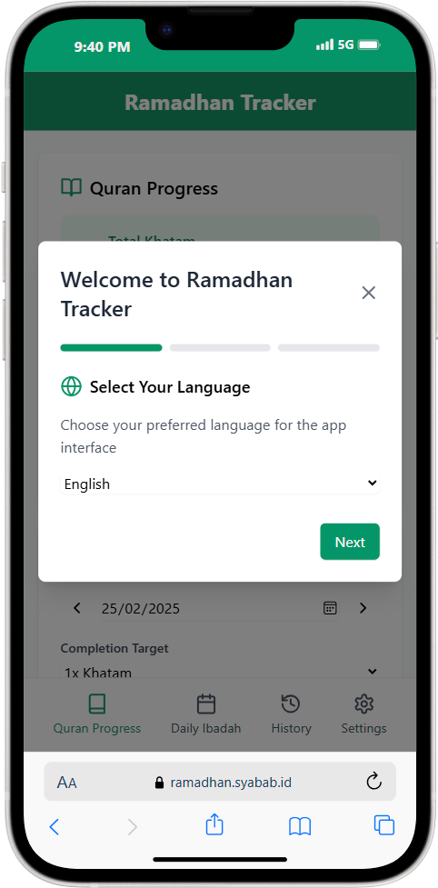
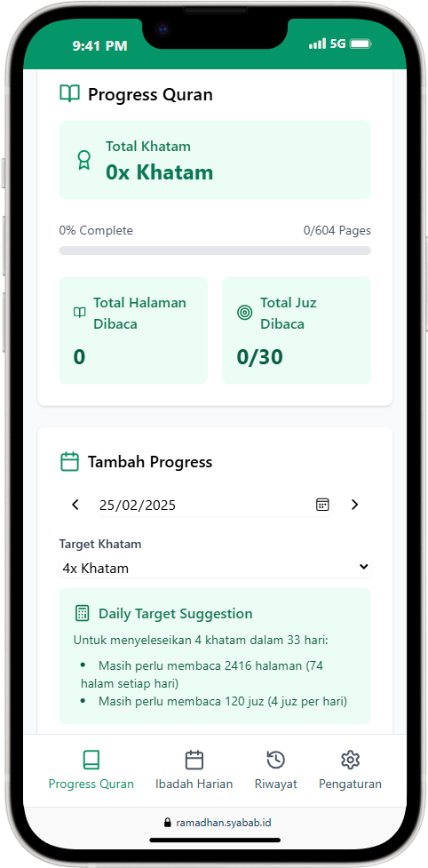
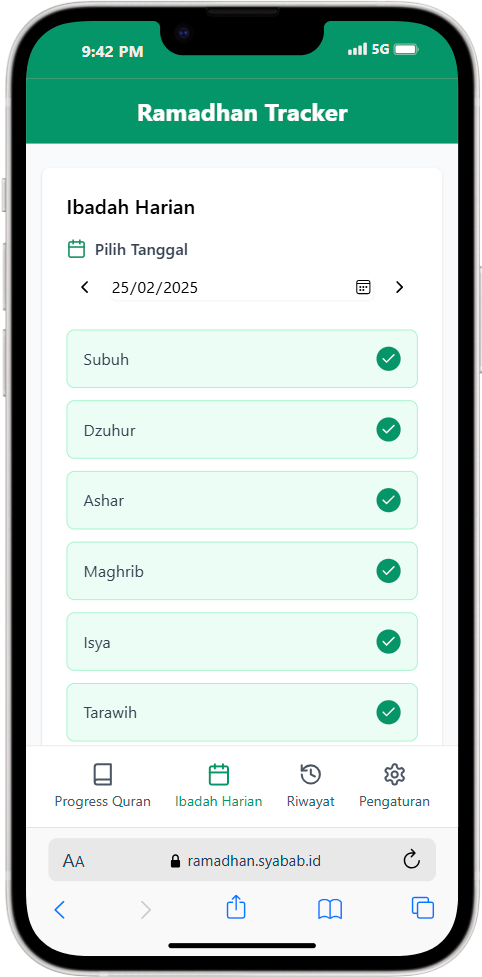
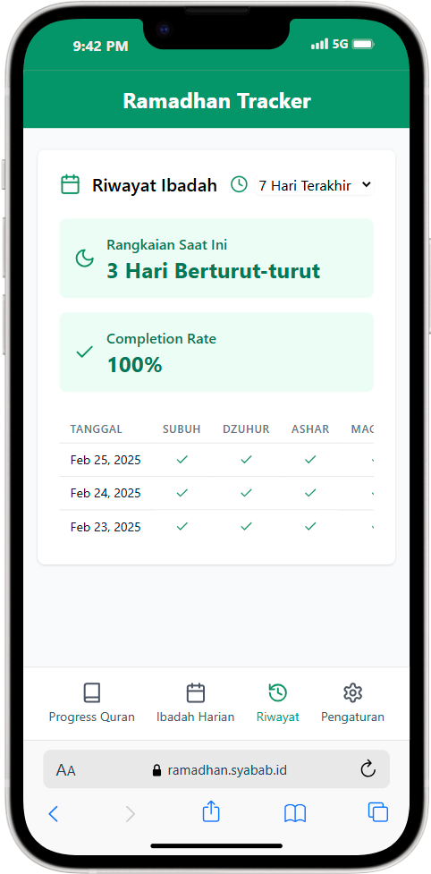
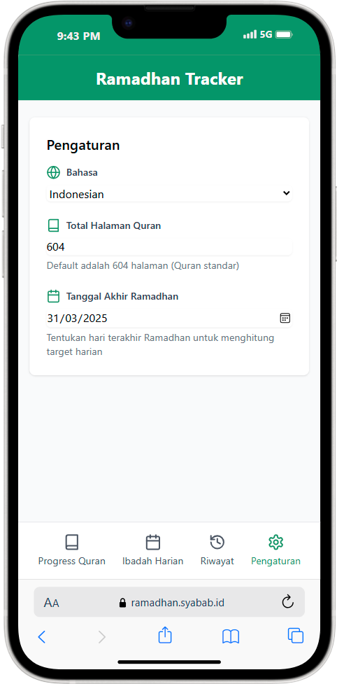

# Ramadhan Tracker

A simple web application to track your Ramadhan activities and Quran progress.

## Screenshots

## Features

- Track your daily prayer and Quran reading activities
- View your progress and streaks
- Supports multiple languages (currently Indonesian and English)

## Installation

1. Clone this repository
2. Run `pnpm install`
3. Run `pnpm run dev` to start the development server

## Usage

1. Open the application in your browser
2. Select your language
3. Start tracking your activities

## Tech Stack

- React
- Tailwind CSS
- Zod
- I18Next
- IDB for indexDB

## Contributing

Contributions are welcome! Please open an issue or a pull request if you have any suggestions or improvements.

## License

This project is licensed under the MIT license. See the [LICENSE](LICENSE) file for more details.
